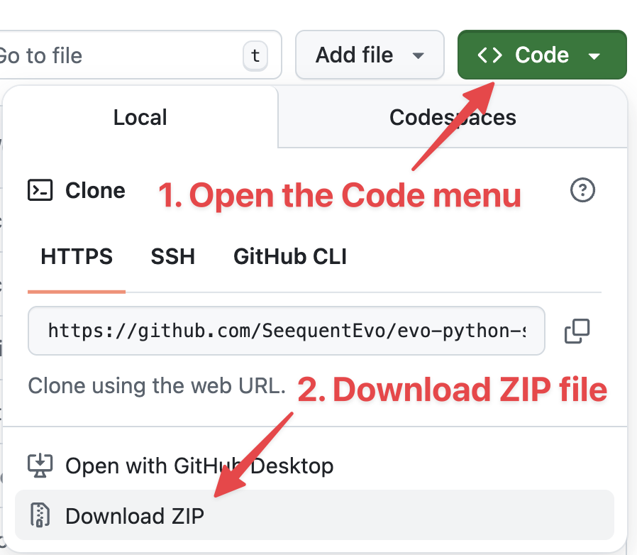
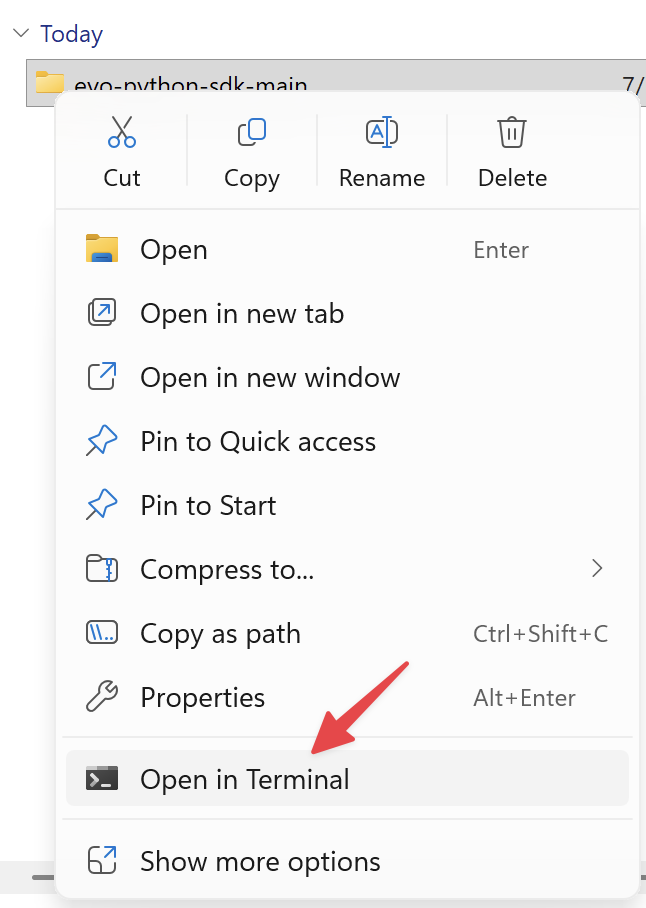
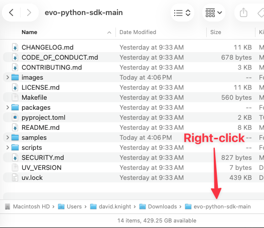
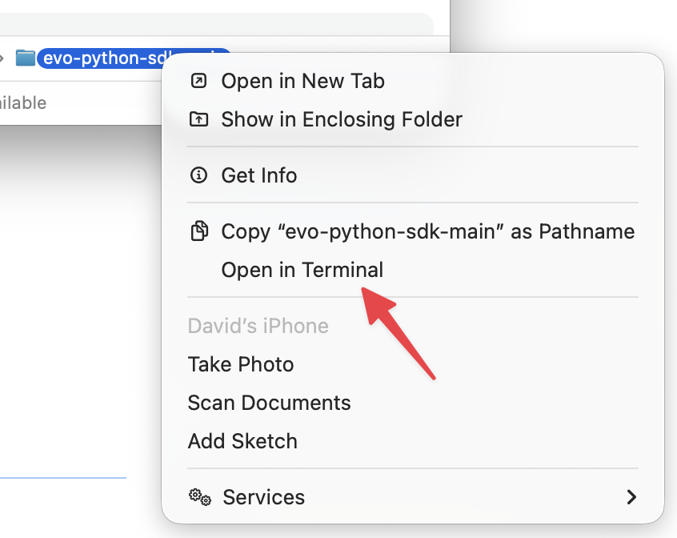
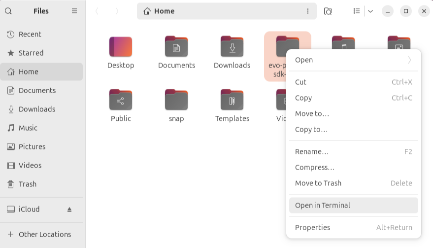
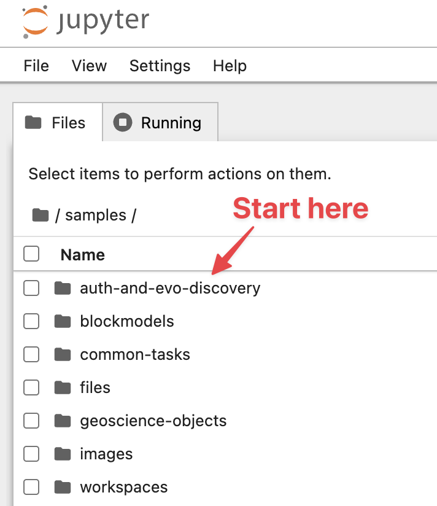

# Evo Code Samples

Welcome to the Evo Python SDK code samples! This directory contains comprehensive Jupyter notebook examples that demonstrate how to use the various Evo APIs for geoscience data management and analysis.

## 📋 Prerequisites

- **Evo app**: You need a [registered app in Bentley](https://developer.bentley.com/register/?product=seequent-evo) to obtain a client ID
- **Python**: Version 3.10 or higher
- **Jupyter Environment**: JupyterLab, VS Code, or another Jupyter notebook editor

## 🚀 Quick start

### 1. Register an Evo app

Register your Evo application in the [Bentley Developer Portal](https://developer.bentley.com/my-apps) to get your client credentials. If a member of your team has already registered an app, contact them and ask for the client credentials.

For in-depth instructions, follow this [guide](https://developer.seequent.com/docs/guides/getting-started/apps-and-tokens) on the Seequent Developer Portal.

### 2. Obtain a local copy of this repository

If you want to focus on the code samples, or if you aren't comfortable using Git, download a copy of this repository as a ZIP file. Visit [https://github.com/SeequentEvo/evo-python-sdk](https://github.com/SeequentEvo/evo-python-sdk) and follow the instructions below:




Alternatively, if you are comfortable using Git:

```shell
git clone https://github.com/SeequentEvo/evo-python-sdk.git
```

### 3. Set up your environment

You must first install the package manager `uv` that will make is easy to set up your Python environment.

Follow the instructions below for [Windows](#windows), [macOS](#macos) or [Linux](#linux).

#### Windows
1. Find the local copy of this repository in **Windows Explorer**. It will be called **evo-python-sdk-main** if you downloaded as a ZIP file.
1. Right-click on the folder and choose **Open in Terminal**.

    

1. Enter the following command to install `uv`.
    ```pwsh
    powershell -ExecutionPolicy Bypass -c "irm https://astral.sh/uv/$(Get-Content ./UV_VERSION)/install.ps1 | iex"
    ```

1. Set up your environment by moving to the **samples** directory and installing the Python dependencies.
    ```pwsh
    # Move to the samples directory
    cd samples

    # Install the dependencies
    uv sync
    ```

### macOS
1. Find the local copy of this repository in **Finder**. It will be called **evo-python-sdk-main** if you downloaded as a ZIP file.

1. Open the folder so that you can see it's contents.
1. On the *Path bar* at the bottom of the window, right-click on **evo-path-sdk-main**.
    
    HINT: If the *Path bar* isn't visible, select **Show Path Bar** from the **View** menu.

     

1. From the pop-up menu, select **Open in Terminal**.

    

1. Enter the following command to install `uv`.
    ```bash
    # From the root directory of the repository
    ./scripts/install-uv.sh
    ```

1. Set up your environment by moving to the **samples** directory and installing the Python dependencies.
    ```bash
    # Move to the samples directory
    cd samples

    # Install the dependencies
    uv sync
    ```

### Linux

NOTE: This example is based on [Ubuntu](https://ubuntu.com), but other Linux environments will operate in a similar way.

1. Find the local copy of this repository in **Files**. It will be called **evo-python-sdk-main** if you downloaded as a ZIP file.
1. Right-click on the folder and choose **Open in Terminal**.

    

1. Enter the following command to install `uv`.
    ```bash
    # From the root directory of the repository
    ./scripts/install-uv.sh
    ```

1. Set up your environment by moving to the **samples** directory and installing the Python dependencies.
    ```bash
    # Move to the samples directory
    cd samples

    # Install the dependencies
    uv sync
    ```

### 4. Run the notebooks

From the **samples** directory, launch Jupyter.

```bash
uv run jupyter notebook
# or if using VS Code, simply open the .ipynb files
```

You should see the **samples** directory in your web browser:



Before diving into the geoscience code samples, we recommend that you first test your Evo app to make sure your client credentials are set up correctly.

📁 **[auth-and-evo-discovery](auth-and-evo-discovery/)**
Essential setup for all other samples. Contains:
- `native-app-token.ipynb` - Authentication for desktop applications
- `service-app-token.ipynb` - Authentication for service applications  
- `evo-discovery.ipynb` - Find your organization ID and hub URL

## 📚 Sample categories

### 🔐 Authentication & discovery
**📁 [auth-and-evo-discovery](auth-and-evo-discovery/)**

Learn about Evo auth and the Evo Discovery service:
- `native-app-token.ipynb` - Authentication for desktop applications
- `service-app-token.ipynb` - Authentication for service applications  
- `evo-discovery.ipynb` - Find your organization ID and hub URL

### 🧊 Block models
**📁 [blockmodels](blockmodels/)**

Comprehensive block model workflows organized by operation:
- **Create**: Regular and variable octree block models
- **Download**: Entire models or specific bounding box regions
- **Manage**: List, delete, and restore block models
- **Update**: Add, delete, rename, and update columns

### 🗂️ File operations
**📁 [files](files/)**

Basic unstructured file management operations:
- Upload files to Evo
- Download files from Evo
- List and organize files
- Delete files

### 🌍 Geoscience objects
**📁 [geoscience-objects](geoscience-objects/)**

Publish and download various geoscience data types:
- Drilling campaigns and downhole collections
- Point sets and triangular meshes
- 2D regular grids
- Complex geoscience data structures

*Note: Some notebooks have platform-specific requirements (e.g., Windows-only dependencies)*

### 🏢 Workspace management
**📁 [workspaces](workspaces/)**

Administrative operations:
- Manage Evo workspaces
- Handle user roles and permissions

### ✨ Extras
**📁 [common-tasks](common-tasks/)**

This section includes tasks that are common across many of the Evo APIs.

Advanced file processing:
- Working with Parquet data files
- Data manipulation

## 🔧 Running a sample

1. **Open the notebook** in your preferred editor
1. **Update the first cell** with your client ID (and redirect URL if needed)
1. **Run the authentication cell** - this will open your browser for Bentley ID sign-in
1. **Select your workspace** using the provided widget
1. **Continue with the remaining cells** in order

## 💡 Tips for success

- **Always start with authentication**: The auth-and-evo-discovery samples are prerequisite for all others
- **Check platform requirements**: Some geoscience-objects samples are Windows-specific
- **Use virtual environments**: Keep dependencies isolated for each project
- **Follow notebook order**: Run cells sequentially for best results
- **Keep credentials secure**: Never commit tokens or credentials to version control

## 📖 Additional resources

- [Seequent Developer Portal](https://developer.seequent.com/docs/guides/getting-started/quick-start-guide)
- [Evo SDK Documentation](../README.md)
- [Seequent Community](https://community.seequent.com/group/19-evo)
- [API References](https://developer.seequent.com/)

## 🆘 Getting help

If you encounter issues:
1. Check that you've completed the authentication setup
2. Verify your Python version (3.10+)
3. Ensure all requirements are installed
4. Visit the [Seequent Community](https://community.seequent.com/group/19-evo) for support
5. Check the [GitHub issues](https://github.com/SeequentEvo/evo-python-sdk/issues) for known problems

Happy coding with Evo! 🎉
